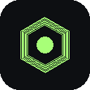
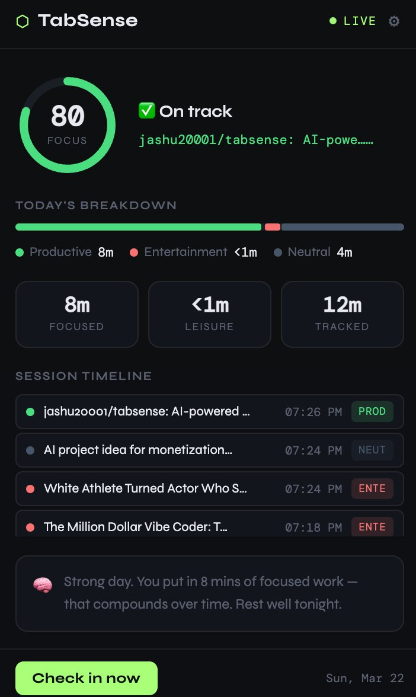

<div align="center">



# TabSense

### AI Focus & Mental Balance Coach

*A Chrome extension that silently watches your browsing, analyzes your patterns,*
*and coaches you like a calm honest friend — not a punishment tool.*

<br/>

[](https://github.com/jashu20001/tabsense)
[](https://developer.chrome.com/docs/extensions/mv3/)
[](https://github.com/jashu20001/tabsense)
[](LICENSE)

<br/>



</div>

---

## What is TabSense?

Most productivity tools punish you for getting distracted. TabSense doesn't.

It understands that **balance is healthy** — 20 minutes of YouTube after 3 hours of deep work is totally fine. What it catches is when you've completely drifted and lost track of your day. Then it nudges you like a friend would, not like a boss.

Everything runs **100% locally** in your browser. No account. No server. No data ever leaves your machine.

---

## Features

| Feature | Description |
|---------|-------------|
| 🎯 **Live Focus Score** | 0–100 score that updates in real time as you browse |
| 📊 **5-Category Tracking** | Productive, Learning, Social, Entertainment, Neutral |
| 🧠 **Smart Notifications** | Warm, human-sounding coach messages — not robotic alerts |
| 📋 **Session Timeline** | Every tab visit color-coded, timestamped, live |
| 📈 **Daily Breakdown** | Visual bar showing exactly how you split your time |
| 🌙 **End-of-Day Reflection** | Honest daily summary sent at 9pm |
| ⚙️ **Fully Configurable** | Work hours, check-in interval, entertainment tolerance |
| 💾 **Export Your Data** | Download sessions as JSON any time |
| 🔒 **100% Private** | Nothing ever leaves your browser |

---

## How the Focus Score Works

The score is **context-aware**, not just a raw ratio.

```
Recent activity (last 30 mins) weighted 2× more than older sessions
Each category carries a productivity weight:

  Productive    ████████████████  1.0
  Learning      █████████████░░░  0.85
  Neutral       ████████░░░░░░░░  0.5
  Social        ████░░░░░░░░░░░░  0.3
  Entertainment █░░░░░░░░░░░░░░░  0.1
```

A bad morning doesn't ruin your afternoon score — it recovers as you refocus.

### Score States

| Score | State | Color |
|-------|-------|-------|
| 65 – 100 | Focused / On track | 🟢 Green |
| 40 – 64 | Drifting / Mixed | 🟡 Amber |
| 0 – 39 | Off track | 🔴 Red |

---

## Smart Notifications

TabSense only speaks up when something worth saying has happened.

| Pattern | Trigger | Tone |
|---------|---------|------|
| `DEEP_FOCUS` | 90+ mins productive, >85% of recent time | Genuine celebration |
| `LIGHT_DISTRACTION` | 20+ mins entertainment, >60% of recent time | Soft nudge |
| `DEEP_DISTRACTION` | 40+ mins entertainment, >80% of recent time | Honest check-in |

> Throttled to **max 1 notification per 25 minutes** — never spammy.

---

## Install

### Load as unpacked extension (30 seconds)

```bash
git clone https://github.com/jashu20001/tabsense.git
```

Then in Chrome:

1. Go to `chrome://extensions`
2. Enable **Developer mode** (toggle top right)
3. Click **Load unpacked** → select the `tabsense/` folder
4. Pin it from the 🧩 puzzle icon in your toolbar

TabSense starts tracking immediately. No setup required.

---

## File Structure

```
tabsense/
├── manifest.json       Extension config (Manifest V3)
├── background.js       Service worker — tracking, alarms, notifications
├── categorizer.js      150+ domain ruleset, scoring, pattern detection
├── popup.html          Dashboard UI
├── popup.css           Dashboard styles
├── popup.js            Dashboard logic
├── options.html        Settings page
├── options.css         Settings styles
├── options.js          Settings logic
└── icons/
    ├── icon16.png
    ├── icon48.png
    └── icon128.png
```

---

## Domain Coverage

**150+ domains** pre-mapped across 5 categories. Unknown domains fall through a 3-level heuristic:

```
1. Exact match       github.com          → Productive
2. Subdomain match   docs.github.com     → Productive  
3. URL keywords      /tutorial/ /learn/  → Learning
```

---

## Settings

| Setting | Default | What it does |
|---------|---------|--------------|
| Notifications | On | Enable / disable all nudges |
| Check interval | 30 min | How often your pattern is analyzed |
| Work start | 9 AM | No notifications before this hour |
| Work end | 10 PM | No notifications after this hour |
| Entertainment tolerance | 30% | Leisure % allowed before nudging |

---

## Privacy

```
✓  No account required
✓  No data ever leaves your browser
✓  No analytics, tracking, or ads
✓  All data stored in chrome.storage.local
✓  Export or wipe any time from Settings
```

---

## Roadmap

- [ ] **Focus Pedometer** — active timer with flip clock, task labels, and XP points
- [ ] **Medals & Levels** — earn badges for focus streaks and deep work sessions
- [ ] **Mood Check-in** — factor how you're feeling into the coaching tone
- [ ] **Weekly Report** — beautiful HTML summary of your week
- [ ] **Smart YouTube** — detect tutorial vs entertainment by page title
- [ ] **Weekly Trends** — charts across 7 and 30 days
- [ ] **Firefox Support**

---

## Contributing

PRs welcome — especially additions to the domain categorizer ruleset.

```bash
git clone https://github.com/jashu20001/tabsense.git
cd tabsense
# load unpacked in chrome://extensions to test
# open a PR with your changes
```

---

## License

MIT — use it, fork it, build on it.

---

<div align="center">

*Built in a day. Designed to actually help.*

**[⬡ jashu20001/tabsense](https://github.com/jashu20001/tabsense)**

</div>
